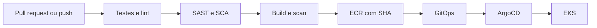

# ToggleMaster - Tech Challenge Fase 3

Evolução do ToggleMaster para uma plataforma automatizada com **Terraform**, **GitHub Actions**, **DevSecOps**, **GitOps**, **ArgoCD** e **Amazon EKS**.

> Repositório público e seguro: nenhum segredo, credencial AWS, senha, token ou estado Terraform deve ser versionado.

## Objetivo

Automatizar a infraestrutura e a entrega dos serviços `auth`, `flag`, `targeting`, `evaluation` e `analytics`.



## Estrutura

```text
├── .github/workflows/      # CI/DevSecOps dos cinco serviços
├── services/               # código dos microsserviços da Fase 2
├── terraform/              # infraestrutura AWS modular
├── gitops/                 # estado desejado do Kubernetes
├── docs/fase-3/            # arquitetura, execução e evidências
└── scripts/                # validações locais
```

## Segurança

- Nunca commite `.env`, `*.tfvars`, `terraform.tfstate`, kubeconfig ou credenciais AWS.
- Workflows esperam secrets configurados fora do código.
- Imagens usam tags imutáveis baseadas no SHA; `latest` não é usado.
- Pods usam a identidade do Node Group/LabRole; access keys não entram nos manifests.
- Segredos Kubernetes são criados fora do Git.

Leia [SECURITY.md](SECURITY.md) antes de configurar o ambiente.

## Região e ambiente

- Região: `us-east-2` (Ohio).
- AWS Academy com `LabRole` existente.
- O Terraform não cria Roles ou Policies de IAM.
- Clonar o repositório não cria nem cobra recursos AWS.

## Início rápido

```bash
cp .env.example .env
docker compose up --build -d
./scripts/validate-all.sh
```

Para a nuvem, consulte [docs/fase-3/GUIA_EXECUCAO.md](docs/fase-3/GUIA_EXECUCAO.md).
