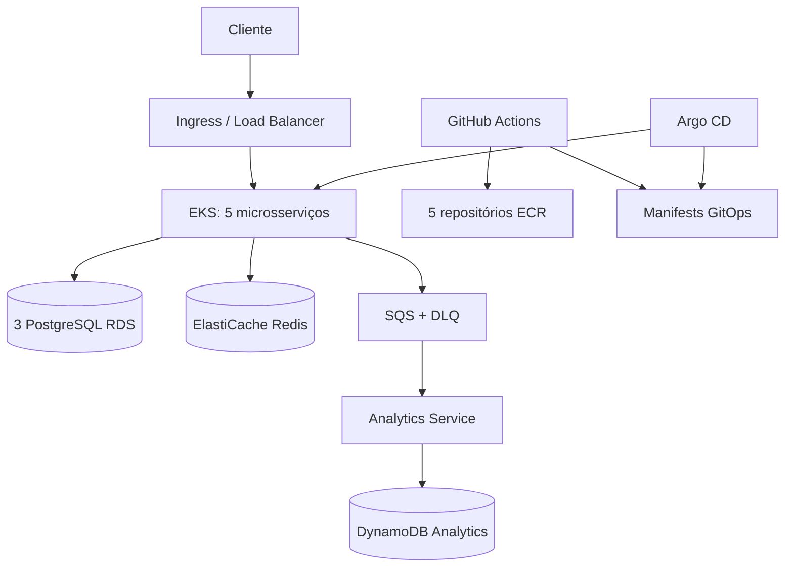
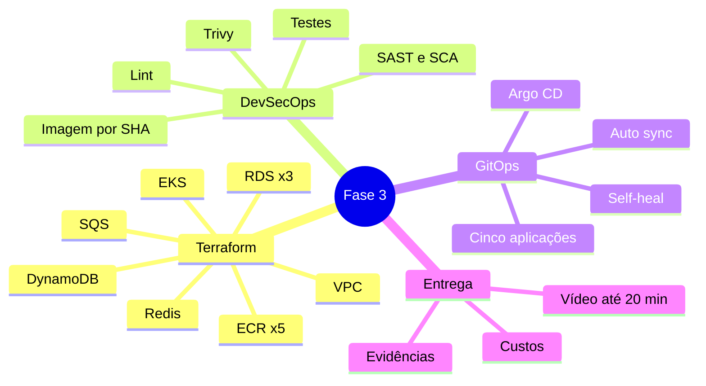

# Arquitetura da Fase 3

## Visão geral

Tudo é provisionado em `us-east-2`. A VPC possui duas sub-redes públicas e duas privadas em zonas distintas. EKS e bancos ficam nas privadas; o tráfego externo entra pelo Ingress. O Terraform reutiliza a `LabRole` fornecida pela AWS Academy e não cria IAM Roles.

## Mapa mental

## Segurança

- Nenhuma credencial é versionada; somente arquivos `.example`.
- Estado Terraform remoto usa S3 com criptografia, versionamento e bloqueio público.
- RDS e Redis não são públicos.
- Imagens ECR são imutáveis e escaneadas no push.
- Pipelines falham em vulnerabilidade crítica.
- Workloads AWS usam identidade do ambiente, não chaves estáticas em Kubernetes.
